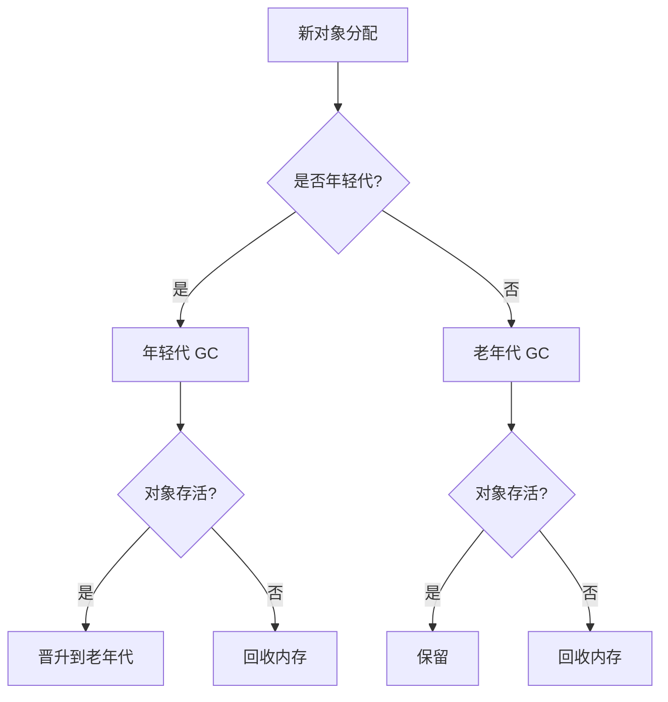
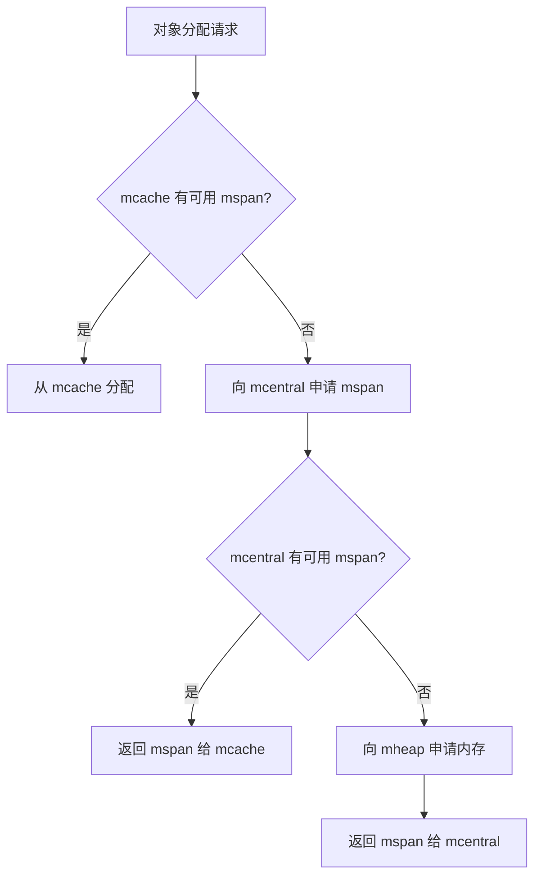

# Go 内存管理与编译器优化

本文深入探讨 Go 语言的自动内存管理、垃圾回收机制以及编译器优化技术，结合具体示例和流程图，帮助你理解 Go 内存管理的核心原理和性能优化方法。

---

## 01 自动内存管理

### 1.1 什么是自动内存管理？
自动内存管理（垃圾回收，GC）是指由程序语言的运行时系统管理动态内存，开发者无需手动分配和释放内存。

**核心概念**：
- **动态内存**：程序运行时根据需求动态分配的内存（如 `malloc()`）。
- **Mutator**：业务线程，负责分配新对象和修改对象指向关系。
- **Collector**：GC 线程，负责找到存活对象并回收死亡对象的内存空间。

### 1.2 垃圾回收算法分类
- **Serial GC**：只有一个 Collector，单线程执行。
- **Parallel GC**：多个 Collectors 同时回收。
- **Concurrent GC**：Mutators 和 Collectors 可以同时执行。

**GC 算法评价标准**：
- **安全性**：不能回收存活的对象。
- **吞吐率**：`1 - (GC 时间 / 程序执行总时间)`。
- **暂停时间**：Stop The World (STW) 的时间，业务是否感知。
- **内存开销**：GC 元数据的额外内存占用。

### 1.3 追踪垃圾回收（Tracing GC）
追踪垃圾回收的核心思想是通过指针的可达性判断对象是否存活。

**流程**：
1. **标记根对象**：静态变量、全局变量、常量、线程栈等。
2. **标记可达对象**：从根对象出发，找到所有可达对象。
3. **清理不可达对象**：
   - **Copying GC**：将存活对象复制到另一块内存。
   - **Mark-Sweep GC**：将死亡对象的内存标记为可分配。
   - **Mark-Compact GC**：移动并整理存活对象。

**示例：Mark-Sweep GC**
```go
// 伪代码：标记-清除算法
func mark(root *Object) {
    if root == nil || root.marked {
        return
    }
    root.marked = true
    for _, child := range root.children {
        mark(child)
    }
}

func sweep() {
    for obj := range heap {
        if !obj.marked {
            free(obj)
        } else {
            obj.marked = false
        }
    }
}
```

### 1.4 分代垃圾回收
根据对象的生命周期，将内存划分为不同区域，采用不同的回收策略。

- **年轻代（Young Generation）**：
  - 对象存活时间短，存活对象少。
  - 采用 Copying GC，吞吐率高。
- **老年代（Old Generation）**：
  - 对象存活时间长，反复回收开销大。
  - 采用 Mark-Sweep GC。

**流程图：分代垃圾回收**


### 1.5 引用计数（Reference Counting）
每个对象维护一个引用计数，当引用计数为 0 时回收对象。

**优点**：
- 内存管理操作平摊到程序执行过程中。
- 无需了解运行时实现细节（如 C++ 智能指针）。

**缺点**：
- 维护引用计数的开销大（需原子操作）。
- 无法回收环形数据结构。
- 每个对象需额外内存存储引用计数。

**示例：引用计数**
```go
type Object struct {
    refCount int
    data     string
}

func (o *Object) AddRef() {
    atomic.AddInt32(&o.refCount, 1)
}

func (o *Object) Release() {
    if atomic.AddInt32(&o.refCount, -1) == 0 {
        free(o)
    }
}
```

---

## 02 Go 内存管理及优化

### 2.1 Go 内存分配
Go 的内存分配器基于 TCMalloc（Thread-Caching Malloc），核心思想是分块和缓存。

**分块**：
- 调用 `mmap()` 向操作系统申请大块内存。
- 将内存划分为 `mspan`（大块），再划分为特定大小的小块。
  - **noscan mspan**：分配不包含指针的对象，GC 不需要扫描。
  - **scan mspan**：分配包含指针的对象，GC 需要扫描。

**缓存**：
- 每个 P（Processor）包含一个 `mcache`，用于快速分配小对象。
- 当 `mcache` 中的 `mspan` 用完时，向 `mcentral` 申请新的 `mspan`。
- 当 `mspan` 中没有对象时，缓存在 `mcentral` 中，而非立即释放。

**流程图：Go 内存分配**


### 2.2 内存管理优化
Go 内存分配的高频操作和小对象占比较高，导致分配耗时。

**优化方案：Balanced GC**
- 每个 Goroutine 绑定一块内存（1KB），称为 Goroutine Allocation Buffer (GAB)。
- GAB 用于分配小于 128B 的 `noscan` 小对象。
- 使用指针碰撞（Bump Pointer）风格分配，无需互斥锁。

**优点**：
- 将多个小对象的分配合并为一次大对象分配。
- 分配动作简单高效。

**缺点**：
- GAB 的内存释放可能延迟。

---

## 03 编译器与静态分析

### 3.1 编译器结构
- **前端（Front End）**：词法分析、语法分析、语义分析。
- **后端（Back End）**：代码生成、优化。

### 3.2 静态分析
静态分析是在不执行程序的情况下，推导程序的行为和性质。

**分析内容**：
- **控制流**：程序执行的流程。
- **数据流**：数据在控制流上的传递。

**分类**：
- **过程内分析**：仅在函数内部进行分析。
- **过程间分析**：考虑函数调用时的参数传递和返回值。

---

## 04 Go 编译器优化

### 4.1 函数内联（Inlining）
将调用函数的函数体副本替换到调用位置，并重写代码以反映参数绑定。

**优点**：
- 消除函数调用开销。
- 将过程间分析转化为过程内分析。

**缺点**：
- 函数体变大，影响指令缓存。
- 编译生成的二进制文件变大。

**示例：函数内联**
```go
// 内联前
func add(a, b int) int {
    return a + b
}

func main() {
    result := add(1, 2)
    fmt.Println(result)
}

// 内联后
func main() {
    result := 1 + 2
    fmt.Println(result)
}
```

### 4.2 Beast Mode
Beast Mode 是 Go 编译器的一种优化模式，调整函数内联策略，使更多函数被内联。

**优点**：
- 降低函数调用开销。
- 增加逃逸分析的机会，减少堆分配。

**示例：逃逸分析优化**
```go
// 优化前：对象逃逸到堆
func createObject() *Object {
    return &Object{}
}

// 优化后：对象在栈上分配
func createObject() Object {
    return Object{}
}
```

---

## 05 性能调优案例

### 5.1 业务服务优化

**问题描述**  
某业务服务的接口响应时间较长，用户请求的平均响应时间超过 500ms，导致用户体验下降。

**分析过程**  
1. **使用 `pprof` 进行性能分析**：
   - 启动 `pprof` 的 CPU 和 Heap 分析，发现数据库查询占用了 70% 的 CPU 时间。
   - 进一步分析发现，某些 SQL 查询未使用索引，导致全表扫描。
   
2. **定位瓶颈**：
   - 通过日志和 `pprof` 数据，定位到以下几个问题：
     - 高频查询未使用索引。
     - 部分查询返回过多无用数据。
     - 重复查询相同数据。

**优化方案**  
1. **优化 SQL 查询**：
   - 为高频查询字段添加索引。
   - 使用 `SELECT` 只查询需要的字段，避免返回过多数据。
   - 使用 `EXPLAIN` 分析查询执行计划，确保查询效率。

   **示例：优化 SQL 查询**
   ```sql
   -- 优化前
   SELECT * FROM users WHERE age > 20;
   
   -- 优化后
   SELECT id, name FROM users WHERE age > 20;
   CREATE INDEX idx_age ON users(age);
   ```

2. **引入缓存**：
   - 使用 Redis 缓存高频查询结果，减少数据库压力。
   - 设置合理的缓存过期时间，避免数据不一致。

   **示例：使用 Redis 缓存**
   ```go
   func getUserFromCache(userID int) (*User, error) {
       var user User
       cacheKey := fmt.Sprintf("user:%d", userID)
       err := redisClient.Get(cacheKey, &user)
       if err == nil {
           return &user, nil
       }
   
       // 缓存未命中，查询数据库
       user, err := db.GetUser(userID)
       if err != nil {
           return nil, err
       }
   
       // 将结果写入缓存
       redisClient.Set(cacheKey, user, time.Hour)
       return &user, nil
   }
   ```

3. **优化结果**：
   - 接口响应时间从 500ms 降低到 50ms。
   - 数据库 CPU 使用率从 70% 降低到 20%。

---

### 5.2 基础库优化

**问题描述**  
某基础库在高并发场景下性能不足，表现为内存分配频繁、锁竞争激烈，导致服务吞吐量下降。

**分析过程**  
1. **使用 `pprof` 进行性能分析**：
   - 通过 Heap 分析发现，大量内存分配来自于临时对象的创建。
   - 通过 Mutex 分析发现，某些锁的竞争非常激烈。

2. **定位瓶颈**：
   - 频繁创建和销毁临时对象，导致 GC 压力大。
   - 锁竞争导致 Goroutine 阻塞，影响并发性能。

**优化方案**  
1. **使用 `sync.Pool` 减少内存分配**：
   - 通过对象池复用临时对象，减少内存分配和 GC 压力。

   **示例：使用 `sync.Pool`**
   ```go
   var bufferPool = sync.Pool{
       New: func() interface{} {
           return new(bytes.Buffer)
       },
   }
   
   func getBuffer() *bytes.Buffer {
       return bufferPool.Get().(*bytes.Buffer)
   }
   
   func putBuffer(buf *bytes.Buffer) {
       buf.Reset()
       bufferPool.Put(buf)
   }
   ```

2. **使用 `atomic` 减少锁竞争**：
   - 将部分锁保护的操作替换为原子操作，减少锁竞争。

   **示例：使用 `atomic`**
   ```go
   var counter int64
   
   func incrementCounter() {
       atomic.AddInt64(&counter, 1)
   }
   
   func getCounter() int64 {
       return atomic.LoadInt64(&counter)
   }
   ```

3. **优化结果**：
   - 内存分配减少 50%，GC 压力显著降低。
   - 锁竞争减少，服务吞吐量提升 30%。

---

### 5.3 Go 语言优化

**问题描述**  
某服务在高并发场景下，GC（垃圾回收）压力较大，导致服务出现周期性延迟。

**分析过程**  
1. **使用 `pprof` 进行性能分析**：
   - 通过 Heap 分析发现，堆内存中存在大量短期对象。
   - 通过 Goroutine 分析发现，Goroutine 数量过多，导致调度开销增加。

2. **定位瓶颈**：
   - 频繁创建和销毁短期对象，导致 GC 频繁触发。
   - Goroutine 数量过多，导致调度器负载过高。

**优化方案**  
1. **减少堆内存分配**：
   - 使用栈分配代替堆分配，减少 GC 压力。
   - 复用对象，避免频繁创建和销毁。

   **示例：复用对象**
   ```go
   var userPool = sync.Pool{
       New: func() interface{} {
           return new(User)
       },
   }
   
   func getUser() *User {
       return userPool.Get().(*User)
   }
   
   func putUser(user *User) {
       user.Reset()
       userPool.Put(user)
   }
   ```

2. **控制 Goroutine 数量**：
   - 使用 Goroutine 池限制并发数量，避免 Goroutine 数量过多。

   **示例：使用 Goroutine 池**
   ```go
   func workerPool(workerNum int, tasks <-chan func()) {
       var wg sync.WaitGroup
       for i := 0; i < workerNum; i++ {
           wg.Add(1)
           go func() {
               defer wg.Done()
               for task := range tasks {
                   task()
               }
           }()
       }
       wg.Wait()
   }
   ```

3. **优化结果**：
   
   - GC 频率降低，服务延迟减少。
   - Goroutine 数量控制在合理范围，调度开销降低。

---

## 总结

通过以上案例可以看出，性能调优的关键在于：
1. **定位瓶颈**：使用 `pprof` 等工具分析性能数据，找到真正的瓶颈。
2. **针对性优化**：根据瓶颈类型（如 CPU、内存、锁竞争等）选择合适的优化方法。
3. **验证效果**：通过性能测试验证优化效果，确保优化方案有效。

希望这些案例能为你的性能调优工作提供实用参考！
