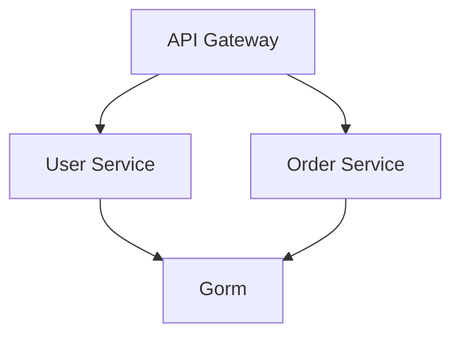

# Go 开发框架三件套

## 1. Gorm - 强大的 ORM 框架深度扩展

### 1.1 基本使用增强版

#### 1.1.1 完整 CRUD 操作示例
```go
// 创建记录（批量插入）
users := []User{
    {Name: "Alice", Age: 25},
    {Name: "Bob", Age: 30},
    {Name: "Charlie", Age: 35},
}
db.Create(&users)  // 一次性插入所有记录

// 查询记录（带条件）
var activeUsers []User
db.Where("status = ? AND age > ?", "active", 25).
   Order("created_at desc").
   Limit(10).
   Offset(0).
   Find(&activeUsers)

// 更新多个字段
db.Model(&User{}).Where("role = ?", "admin").
   Updates(map[string]interface{}{
       "age":    40,
       "status": "inactive",
   })

// 删除记录（带条件）
db.Where("email LIKE ?", "%@test.com").Delete(&User{})
```

#### 1.1.2 高级查询技巧
```go
// 子查询
subQuery := db.Select("AVG(age)").Where("department = ?", "IT").Table("users")
db.Where("age > (?)", subQuery).Find(&users)

// 原生 SQL 执行
db.Exec("UPDATE users SET balance = balance * ? WHERE level > ?", 1.1, 3)

// 查询结果映射到自定义结构体
type UserProfile struct {
    Name  string
    Email string
}
db.Model(&User{}).Select("name, email").Scan(&UserProfile{})
```

### 1.2 软删除进阶实践

#### 1.2.1 自定义删除字段
```go
type CustomModel struct {
    ID        uint `gorm:"primarykey"`
    CreatedAt time.Time
    UpdatedAt time.Time
    Deleted   gorm.DeletedAt `gorm:"index;column:deleted_at"`
}

type Product struct {
    CustomModel
    Name  string
    Price float64
}

// 使用自定义删除字段
db.Where("price < ?", 100).Delete(&Product{})
```

#### 1.2.2 软删除与关联关系
```go
type Company struct {
    gorm.Model
    Name     string
    Products []Product `gorm:"foreignKey:CompanyID"`
}

// 级联软删除
db.Select("Products").Delete(&company)
```

### 1.3 事务管理增强

#### 1.3.1 分布式事务示例（Saga模式）
```go
// 创建订单事务
err := db.Transaction(func(tx *gorm.DB) error {
    // 扣减库存
    if err := tx.Model(&Inventory{}).
        Where("product_id = ?", order.ProductID).
        Update("quantity", gorm.Expr("quantity - ?", order.Quantity)).
        Error; err != nil {
        return err
    }

    // 创建订单
    if err := tx.Create(&order).Error; err != nil {
        return err
    }

    // 调用支付服务（外部系统）
    if err := paymentClient.Charge(order.Total); err != nil {
        return err  // 自动回滚
    }

    return nil
})
```

#### 1.3.2 事务隔离级别配置
```go
// 设置事务隔离级别为可重复读
tx := db.Set("gorm:query_options", "SET TRANSACTION ISOLATION LEVEL REPEATABLE READ").Begin()

// 在事务中执行操作
tx.Model(&User{}).Where("id = ?", 1).Update("balance", gorm.Expr("balance - ?", 100))
tx.Commit()
```

### 1.4 Hook 全生命周期管理

#### 1.4.1 完整 Hook 列表及执行顺序
```go
type Order struct {
    gorm.Model
    Status     string
    TotalPrice float64
}

// 创建流程
func (o *Order) BeforeCreate(tx *gorm.DB) error {
    o.Status = "pending"
    return nil
}

func (o *Order) AfterCreate(tx *gorm.DB) error {
    tx.Model(o).Update("order_no", generateOrderNo())
    return nil
}

// 更新流程
func (o *Order) BeforeUpdate(tx *gorm.DB) error {
    if o.Status == "shipped" {
        o.TotalPrice *= 1.1  // 增加运费
    }
    return nil
}
```

#### 1.4.2 审计日志实现
```go
func (u *User) BeforeUpdate(tx *gorm.DB) error {
    if tx.Statement.Changed("Email") {
        oldEmail := tx.Statement.Old("Email").(string)
        newEmail := tx.Statement.New("Email").(string)
        audit := AuditLog{
            UserID:    u.ID,
            Action:    "UPDATE_EMAIL",
            OldValue:  oldEmail,
            NewValue:  newEmail,
        }
        tx.Create(&audit)
    }
    return nil
}
```

### 1.5 性能优化深度指南

#### 1.5.1 连接池最佳配置
```go
sqlDB, err := db.DB()
if err != nil {
    panic("failed to get database handle")
}

// 连接池配置
sqlDB.SetMaxIdleConns(20)          // 空闲连接数
sqlDB.SetMaxOpenConns(100)         // 最大打开连接数
sqlDB.SetConnMaxLifetime(time.Hour) // 连接最大生命周期
sqlDB.SetConnMaxIdleTime(30*time.Minute) // 空闲连接最大存活时间
```

#### 1.5.2 索引优化策略
```go
type Product struct {
    gorm.Model
    SKU      string `gorm:"index:idx_sku,unique"`
    Category string `gorm:"index:idx_category"`
    Price    float64
}

// 复合索引
db.Model(&Order{}).AddIndex("idx_status_created", "status", "created_at")

// 表达式索引（PostgreSQL）
db.Exec("CREATE INDEX idx_lower_name ON users ((lower(name)))")
```

### 1.6 生态扩展实践

#### 1.6.1 常用插件示例
```go
// 分页插件
import "gorm.io/plugin/pagination"

db.Use(pagination.Register)

var users []User
result := db.Scopes(pagination.Paginate(page, pageSize)).Find(&users)

// 数据加密插件
import "github.com/go-gorm/gorm/v2/plugin/crypto"

db.Use(crypto.NewCryptoPlugin(crypto.Config{
    Keys: [][]byte{[]byte("32-byte-long-secret-key-here")},
}))
```

#### 1.6.2 多数据库支持
```go
// MySQL 配置
mysqlDB, err := gorm.Open(mysql.Open(dsn), &gorm.Config{})

// PostgreSQL 配置
postgresDB, err := gorm.Open(postgres.Open(dsn), &gorm.Config{
    NamingStrategy: schema.NamingStrategy{
        TablePrefix: "tbl_",
    },
})

// SQLite 配置
sqliteDB, err := gorm.Open(sqlite.Open("gorm.db"), &gorm.Config{
    DisableForeignKeyConstraintWhenMigrating: true,
})
```

### 1.7 高级特性

#### 1.7.1 多租户架构实现
```go
// 基于 schema 的多租户
db.Use(multitenancy.New(multitenancy.Config{
    TenantKey: "X-Tenant-ID",
    Resolver: func(c *multitenancy.Context) string {
        return c.Request.Header.Get("X-Tenant-ID")
    },
}))

// 自动路由到对应 schema
db.Scopes(func(d *gorm.DB) *gorm.DB {
    return d.Table("tenant_" + tenantID + ".users")
})
```

#### 1.7.2 版本化迁移
```go
// 使用 Atlas 迁移工具
// 创建迁移文件
migrate create --dir migrations --format golang add_users_table

// 执行迁移
migrate apply --dir migrations --dialect mysql
```

### 1.8 最佳实践总结

1. **查询优化**：
   - 始终使用 `Select()` 指定需要的字段
   - 避免 N+1 查询，合理使用 `Preload`
   - 对高频查询字段建立合适索引

2. **事务管理**：
   - 保持事务简短
   - 合理设置隔离级别
   - 使用 `SavePoint` 处理复杂事务

3. **模型设计**：
   - 合理使用 `gorm.Model`
   - 定义明确的字段约束
   - 使用合适的字段类型

4. **性能监控**：
   - 集成 Prometheus 监控
   - 定期分析慢查询日志
   - 监控连接池使用情况

## 2. Kitex - Golang 微服务 RPC 框架

### 2.1 基本使用
- **IDL 定义**:
  ```thrift
  service HelloService {
      string SayHello(1: string name)
  }
  ```
- **服务默认监听 8888 端口**:
  
  ```go
  svr := hello.NewServer(new(HelloServiceImpl))
  svr.Run()
  ```
- **创建 Client**:
  ```go
  client := hello.MustNewClient("hello", client.WithHostPorts("127.0.0.1:8888"))
  ```
- **发起请求**:
  ```go
  resp, err := client.SayHello(context.Background(), "World")
  ```

### 2.2 服务注册与发现
- **对接主流注册中心**:
  ```go
  client := hello.MustNewClient("hello", client.WithResolver(rpc.NewResolver("etcd://127.0.0.1:2379")))
  ```

### 2.3 生态
- Kitex 拥有丰富的扩展生态，支持多种协议和编解码器。

## 3. Hertz - 字节内部的 HTTP 框架

### 3.1 基本使用
- **路由注册**:
  ```go
  h := server.Default()
  h.GET("/ping", func(c context.Context, ctx *app.RequestContext) {
      ctx.String(200, "pong")
  })
  h.Spin()
  ```
- **路由组**:
  ```go
  v1 := h.Group("/v1")
  v1.GET("/hello", func(c context.Context, ctx *app.RequestContext) {
      ctx.String(200, "hello")
  })
  ```
- **参数绑定**:
  ```go
  type Params struct {
      Name string `query:"name"`
  }
  h.POST("/bind", func(c context.Context, ctx *app.RequestContext) {
      var params Params
      ctx.Bind(&params)
      ctx.String(200, params.Name)
  })
  ```

### 3.2 中间件
- **服务端中间件**:
  ```go
  h.Use(func(c context.Context, ctx *app.RequestContext) {
      start := time.Now()
      ctx.Next(c)
      latency := time.Since(start)
      log.Printf("Latency: %s", latency)
  })
  ```

### 3.3 代码生成工具
- **HZ 工具**:
  ```bash
  hz new -mod github.com/example/hertz-example
  hz update -idl hello.thrift
  ```

### 3.4 性能优化
- **网络库 Netpoll**:
  ```go
  h := server.New(server.WithNetwork("netpoll"))
  ```
- **Json 编解码 Sonic**:
  ```go
  h := server.New(server.WithJsonSerializer(sonic.New()))
  ```

### 3.5 生态
- Hertz 拥有丰富的扩展生态，支持多种中间件和插件。

## 4. 实战案例

### 4.1 项目结构


### 4.2 示例代码
- **API Gateway**:
  ```go
  h := server.Default()
  h.GET("/user/:id", func(c context.Context, ctx *app.RequestContext) {
      id := ctx.Param("id")
      resp, err := userClient.GetUser(c, id)
      if err != nil {
          ctx.String(500, err.Error())
          return
      }
      ctx.JSON(200, resp)
  })
  h.Spin()
  ```

- **User Service**:
  ```go
  svr := user.NewServer(new(UserServiceImpl))
  svr.Run()
  ```

## 5. 总结
- **Gorm**: 强大的 ORM 框架，支持软删除、事务、Hook 等功能。
- **Kitex**: 高性能的微服务 RPC 框架，支持服务注册与发现。
- **Hertz**: 高性能的 HTTP 框架，支持路由组、中间件、参数绑定等功能。